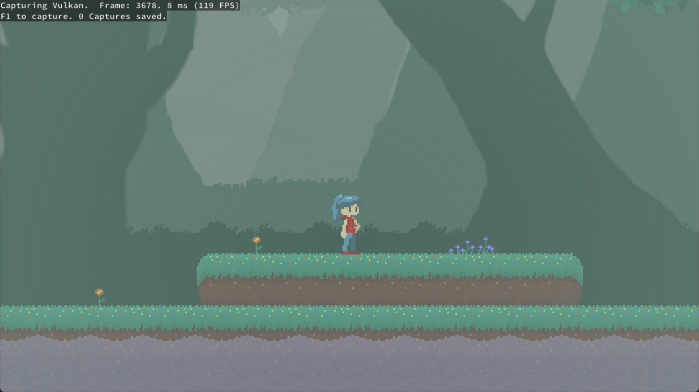

# ps5sim

[🇮🇷 فارسی](README-fa.md) | [🇺🇸 English](README.md)

[](#system-requirements)
[](#current-status)
[](LICENSE)

 [Ps5sim](https://github.com/Shayansatt/ps5sim)

ps5sim is a free and open-source PlayStation 5 emulator written in C++ for Windows. It is based on
a heavily modified version of [Kyty](https://github.com/InoriRus/Kyty) (via [KytyPS5](https://github.com/KytyPS5/KytyPS5)). The project is in an early
stage of development, so compatibility is limited and behavior may change significantly between
builds.

> [!IMPORTANT]
> ps5sim is not affiliated with Sony Interactive Entertainment or PlayStation. The project does
> not distribute games or copyrighted system software. Use only game files that you have obtained
> legally.

## Current Status

ps5sim can boot 2D games and a selection of 3D games, including titles built with Unreal Engine
4/5, Unity, and custom engines. No external low-level emulation modules are currently required.

Development is focused on compatibility and boot reliability.

Linux support is planned, but Windows is the only supported platform at this time.

## Bugs and Issues

The project is in an early stage, so please be mindful when opening new issues. Expect crashes,
graphical glitches, low compatibility, and poor performance.

## Screenshots

<table align="center">
  <tr>
    <td align="center">
      <strong>GUI</strong><br>
      
    </td>
    <td align="center">
      <strong>Dreaming Sarah</strong><br>
      
    </td>
  </tr>
  <tr>
    <td align="center">
      <strong>Minecraft Legends</strong><br>
      
    </td>
    <td align="center">
      <strong>SILENT HILL: The Short Message</strong><br>
      
    </td>
  </tr>
</table>

## Contributing

Testing games and submitting detailed bug reports are useful ways to contribute. Search existing
issues first, then use the **Game Emulation Bug Report** template and attach the complete log file.

Code contributions should be focused, build successfully on Windows, and include relevant tests
where practical. Because ps5sim is still evolving quickly, consider opening an issue before
starting a large change.

## Developer Information

The PS5 graphics architecture is based on AMD RDNA 2. Use AMD's
[RDNA 2 Instruction Set Architecture Reference Guide (document 70648)](https://docs.amd.com/v/u/en-US/rdna2-shader-instruction-set-architecture)
as the primary instruction-encoding reference when working on shader decoding and recompilation.

Important areas of the codebase:

- [`src/graphics/shader/recompiler`](src/graphics/shader/recompiler) — instruction decoding,
  intermediate representation, control flow, resource tracking, and SPIR-V emission
- [`src/graphics/guest_gpu`](src/graphics/guest_gpu) — PS5 (Prospero) GPU formats and command processing
- [`src/graphics/host_gpu`](src/graphics/host_gpu) — Vulkan host backend and resource management
- [`tests`](tests) — focused memory, shader, and resource-tracking regression tests

The renderer targets Vulkan 1.3. Keep shader changes aligned with both the RDNA 2 ISA semantics and
the Vulkan/SPIR-V validation rules.

## Building

### System requirements

- Windows 10 version 1803
- A 64-bit x86 processor
- A Vulkan 1.3-capable GPU with current drivers

### Build requirements

- Git
- CMake 3.12 or newer
- Ninja
- Visual Studio 2022 or Build Tools 2022 with the **Desktop development with C++** workload and
  **C++ Clang tools for Windows** component
- Qt 6 for MSVC 2022 64-bit, including Concurrent, Network, and Widgets
- Vulkan SDK 1.3 or newer

The Microsoft C++ compiler (`cl.exe`) is not supported; use `clang-cl`.

Open an **x64 Native Tools Command Prompt for Visual Studio 2022** (or the equivalent Developer
PowerShell), change to the repository root, and initialize the dependencies:

```powershell
git submodule update --init --recursive
```

Configure the project. Replace the Qt path with the version installed on your system:

```powershell
cmake -S src -B _Build/windows -G Ninja -DCMAKE_BUILD_TYPE=Release -DCMAKE_C_COMPILER=clang-cl -DCMAKE_CXX_COMPILER=clang-cl -DCMAKE_PREFIX_PATH="C:/Qt/6.x.x/msvc2022_64"
```

Build the launcher and stage a runnable installation:

```powershell
cmake --build _Build/windows --target launcher
cmake --install _Build/windows --prefix _Build/windows/install
```

The finished application and its runtime dependencies will be placed in
`_Build/windows/install`.

### Visual Studio Code

A ready-made Visual Studio Code setup is included in [`.vscode`](.vscode). It configures CMake
Tools to build the project with Ninja and `clang-cl` and provides launch profiles for both
`launcher.exe` and `ps5sim_emulator.exe`.

Before using it:

1. Install the **CMake Tools** and **C/C++** extensions in Visual Studio Code.
2. Update `CMAKE_PREFIX_PATH` in [`.vscode/settings.json`](.vscode/settings.json) to point to your
   Qt 6 MSVC installation.
3. Update the `--game` path in [`.vscode/launch.json`](.vscode/launch.json) for the
   **Debug ps5sim_emulator** profile.
4. Open the repository in an x64 Visual Studio developer environment, configure the CMake project,
   and select a launch profile from **Run and Debug**.

## Running

Update your graphics driver before reporting rendering problems.

To use the graphical launcher:

```powershell
.\_Build\windows\install\launcher.exe
```

On first launch, add one or more game folders in the global settings. The launcher searches those
folders recursively for game directories containing `eboot.bin`. Select a detected game and run it
from the game list.

The emulator can also be started directly with a legally obtained game directory or ELF file:

```powershell
.\_Build\windows\install\ps5sim_emulator.exe --game "D:\Games\ExampleGame"
```

Run `ps5sim_emulator.exe --help` to see the available graphics, logging, validation, profiling, and
debugging options.

### AI Use

AI tools may be used for research, reverse engineering, and development assistance. Contributors
must fully understand, review, and test all code they submit and remain responsible for its
correctness. Repository communication, including pull-request descriptions, code comments, and
issue comments, must come from the human contributor rather than an autonomous AI agent.

Pull requests that include AI-assisted or AI-generated work should disclose the scope of the AI
involvement and describe the human review and testing performed before submission. Unverified or
untested generated changes may be closed without review.

## License

ps5sim is licensed under the [GNU General Public License version 2](LICENSE)
(`GPL-2.0-only`).

This project is based on the original [Kyty](https://github.com/InoriRus/Kyty), which was released
under the MIT License. Kyty's original copyright and license notice are preserved in
[`LICENSES/Kyty-MIT.txt`](LICENSES/Kyty-MIT.txt). Third-party components remain subject to the
licenses included with those components.

## Special Thanks

- [InoriRus/Kyty](https://github.com/InoriRus/Kyty) — ps5sim is based on a heavily modified version (via KytyPS5)
  of the original Kyty project.
- [shadps4-emu/shadPS4](https://github.com/shadps4-emu/shadPS4) — reference for memory-model
  understanding and the AVPlayer implementation.
